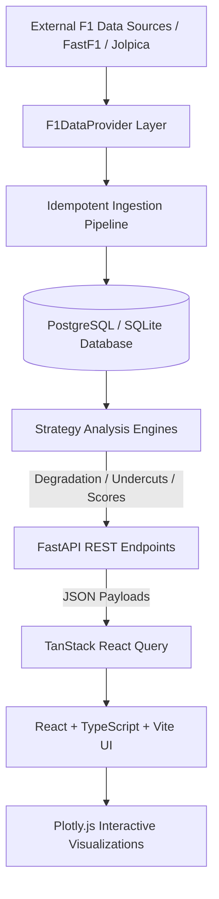

# 🏁 F1 Race Strategy Analyzer

A full-stack, production-grade Formula 1 telemetry and race-strategy analysis platform. Ingests authentic race data, extracts tyre stint lifecycles, computes estimated tyre degradation models, algorithmically detects undercuts and overcuts, scores strategy effectiveness, and presents insights through a modern React + Plotly dashboard.

---

## 📸 Overview & Dashboard Preview

| Strategy Timeline & Gantt View | Lap Time Progression & SC Overlay |
| :--- | :--- |
| Stint compound allocation (Soft, Medium, Hard, Inter, Wet) across all drivers with pit stop diamonds and Safety Car / VSC intervals. | Interactive Plotly flying pace comparison with hover telemetry, zoom, and delta analysis. |

---

## ✨ Features

- **Dynamic Season & Grand Prix Navigation**: Seamlessly filter between seasons (2024, 2023) and Grand Prix rounds (e.g. 2024 Bahrain, Miami, Silverstone, Spa-Francorchamps).
- **Gantt Strategy Timeline**: Visual breakdown of each driver's tyre compound sequence, stint lengths, tyre age, and pit stop durations against race neutralizations.
- **Interactive Lap Pace Charts**: Plotly.js chart displaying lap times, rolling pace, in/out pit laps, and shaded vertical bands for Safety Car and Virtual Safety Car periods.
- **Estimated Tyre Degradation Modeling**: Computes statistical pace deterioration ($s/\text{lap}$) per compound per stint, filtering out SC/VSC laps and out-lap anomalies.
- **Automated Undercut & Overcut Detection**: Algorithmic detection of tactical pit windows, evaluating out-lap fresh-rubber delta vs staying out in clean air with confidence scores and strategic explanations.
- **Proprietary Strategy Effectiveness Score (0–100)**: Transparent analytical index evaluating Pace Efficiency (35 pts), Track Position Gain (30 pts), Tyre Management (20 pts), and Pit Stop Timing (15 pts).
- **Driver Head-to-Head Comparison**: Side-by-side comparative analysis of grid positions, cumulative gap delta over race distance, and compound plan variations.
- **Incident & Race Log**: Chronological feed of Safety Cars, VSCs, Red Flags, weather crossovers, and pit lane entries with filter pills.

---

## 🏗 Architecture

The platform follows a clean **Service-Oriented Architecture (SOA)**:



---

## 🛠 Technology Stack

### Frontend
- **Framework**: React 19 + TypeScript + Vite
- **Styling**: Tailwind CSS (Motorsport Dark Telemetry Theme)
- **Visualizations**: Plotly.js (`react-plotly.js`)
- **State & Caching**: TanStack React Query v5
- **HTTP Client**: Axios
- **Icons**: Lucide React
- **Testing**: Vitest + Testing Library

### Backend
- **Framework**: Python 3.12+ / FastAPI
- **Data Validation & Typing**: Pydantic v2
- **ORM & DB Access**: SQLAlchemy 2.0
- **Data Science & Analytics**: Pandas, NumPy, SciPy
- **Testing**: Pytest + FastAPI TestClient

### Infrastructure & Database
- **Database**: PostgreSQL 16 (with SQLite local fallback)
- **Containerization**: Docker & Docker Compose
- **Web Server**: Nginx (Frontend) + Uvicorn (Backend)

---

## 🗄 Database Schema

```
+---------------+        +-------------------+        +---------------+
|     races     | 1    * |       laps        | *    1 |    drivers    |
+---------------+--------+-------------------+--------+---------------+
| id (PK)       |        | id (PK)           |        | id (PK)       |
| season        |        | race_id (FK)      |        | driver_code   |
| round         |        | driver_id (FK)    |        | full_name     |
| name          |        | lap_number        |        | permanent_num |
| circuit       |        | lap_time (sec)    |        | team          |
| country       |        | sector_1/2/3      |        | team_color    |
| date          |        | position          |        +---------------+
| total_laps    |        | pit_stop (bool)   |
| winner_name   |        | is_valid (bool)   |
+---------------+        +-------------------+
        |
        | 1            * +-------------------+
        +----------------|      stints       |
        |                +-------------------+
        |                | id (PK)           |
        |                | race_id (FK)      |
        |                | driver_id (FK)    |
        |                | stint_number      |
        |                | start_lap/end_lap |
        |                | compound          |
        |                | tyre_age_start/end|
        |                +-------------------+
        |
        | 1            * +-------------------+
        +----------------|     pit_stops     |
        |                +-------------------+
        |                | id (PK)           |
        |                | race_id (FK)      |
        |                | driver_id (FK)    |
        |                | lap               |
        |                | duration (sec)    |
        |                | stop_number       |
        |                +-------------------+
        |
        | 1            * +-------------------+
        +----------------|    race_events    |
                         +-------------------+
                         | id (PK)           |
                         | race_id (FK)      |
                         | lap               |
                         | start_lap/end_lap |
                         | event_type        |
                         | description       |
                         +-------------------+
```

---

## 📐 Strategy Analysis Methodology

### 1. Estimated Tyre Degradation
The tyre degradation model estimates the linear pace loss per lap ($\beta$) for a given stint:

$$\text{LapTime}(t) = \alpha + \beta \cdot \text{TyreAge}(t) - \Delta_{\text{fuel}}(t)$$

- **Filtering**:
  - In-laps (pit stop entry) and out-laps are excluded.
  - Laps within Safety Car or Virtual Safety Car periods ($T_{\text{SC}}, T_{\text{VSC}}$) are filtered out.
  - Outliers exceeding $\pm 15\%$ of median stint pace are discarded.
- **Slope ($\beta$)**: Calculated via ordinary least squares regression (SciPy `linregress`), indicating seconds lost per lap of tyre wear.

> **Disclaimer**: Labeled as **Estimated Tyre Degradation** because empirical lap times are influenced by track evolution, traffic deltas, and fuel burn.

---

### 2. Undercut Detection Algorithm
1. **Trigger Window**: Driver A (Attacker) pits on Lap $L_A$.
2. **Proximity & Position**: Target Driver B is ahead or within 3.5 seconds prior to Driver A's pit stop.
3. **Offset Duration**: Driver B stays out on track for $1 \le (L_B - L_A) \le 4$ laps.
4. **Out-Lap Advantage**: Driver A utilizes fresh rubber to deliver faster intermediate sector pace.
5. **Outcome**: When Driver B pits on Lap $L_B$, we evaluate track position on Lap $L_B + 1$:
   - If Driver A is ahead of Driver B, a successful **UNDERCUT** is registered.
   - If Driver B retains position, an attempted/defended undercut is recorded with the estimated time gained.

---

### 3. Overcut Detection Algorithm
1. **Trigger Window**: Competitor B pits first on Lap $L_B$.
2. **Clean Air Stint Extension**: Driver A stays out on track in clean air for $1 \le (L_A - L_B) \le 4$ laps maintaining strong pace.
3. **Pit & Exit**: Driver A pits on Lap $L_A$ and re-emerges on Lap $L_A + 1$ ahead of Driver B.
4. **Outcome**: A successful **OVERCUT** is registered with confidence score and telemetry explanation.

---

### 4. Strategy Effectiveness Score (0–100)
A transparent composite rating assessing the strategic execution:

$$\text{Total Score} = \text{Pace}_{\text{eff}} + \text{Pos}_{\text{gain}} + \text{Tyre}_{\text{eff}} + \text{Pit}_{\text{eff}}$$

| Component | Max Points | Measurement Criteria |
| :--- | :--- | :--- |
| **Pace Efficiency** | **35 pts** | Lap time consistency ($\sigma_{\text{pace}}$) and stint pace relative to median benchmark. |
| **Position Gain** | **30 pts** | Positions gained from grid start to chequered flag ($P_{\text{start}} - P_{\text{finish}}$) + podium bonus. |
| **Tyre Management** | **20 pts** | Degradation moderation and stint length longevity vs expected compound lifespan. |
| **Pit Stop Execution** | **15 pts** | Pit duration efficiency and capitalizing on cheap pit delta during SC/VSC periods. |

**Rating Thresholds**:
- `90 - 100`: **Exceptional**
- `75 - 89`: **Highly Effective**
- `60 - 74`: **Solid**
- `< 60`: **Suboptimal / Compromised**

---

## 📡 REST API Reference

| Endpoint | Method | Description |
| :--- | :--- | :--- |
| `/api/seasons` | `GET` | Get all available championship seasons. |
| `/api/seasons/{year}/races` | `GET` | List all Grand Prix events for a given season. |
| `/api/races/{race_id}` | `GET` | Get race details, circuit info, winner, and fastest lap. |
| `/api/races/{race_id}/drivers` | `GET` | Get all drivers who participated in the race. |
| `/api/races/{race_id}/laps/{driver_id}` | `GET` | Get lap-by-lap timing and sector breakdown for a driver. |
| `/api/races/{race_id}/all-laps` | `GET` | Get lap times for all or selected drivers (`?drivers=1,2`). |
| `/api/races/{race_id}/strategies` | `GET` | Get tyre stints and pit stops for all drivers. |
| `/api/races/{race_id}/events` | `GET` | Get Safety Car, VSC, Red Flag, and weather incidents. |
| `/api/races/{race_id}/analysis/degradation` | `GET` | Get estimated tyre degradation models per stint. |
| `/api/races/{race_id}/analysis/undercuts` | `GET` | Get all detected undercut strategic moves. |
| `/api/races/{race_id}/analysis/overcuts` | `GET` | Get all detected overcut strategic moves. |
| `/api/races/{race_id}/analysis/scores` | `GET` | Get Strategy Effectiveness Scores for all drivers. |
| `/api/races/{race_id}/compare` | `GET` | Head-to-head driver comparison (`?driver1=1&driver2=2`). |
| `/api/ingest` | `POST` | Ingest/refresh race telemetry (`?season=2024&round=1`). |

---

## 🚀 Local Installation & Quickstart

### Prerequisites
- Python 3.12+
- Node.js 18+ and npm
- (Optional) PostgreSQL 16 or Docker

### 1. Backend Setup
In a terminal, run:
```bash
# Option A: From backend directory
cd backend
python -m uvicorn app.main:app --host 0.0.0.0 --port 8000 --reload

# Option B: From project root
python -m uvicorn app.main:app --app-dir backend --host 0.0.0.0 --port 8000 --reload
```
API Documentation will be live at: [http://localhost:8000/docs](http://localhost:8000/docs)

### 2. Frontend Setup
In a second terminal:
```bash
cd frontend
npm run dev
```
Open your browser at: [http://localhost:5173](http://localhost:5173)

---

## 🐳 Docker Deployment

To launch the complete multi-container stack (Frontend + Backend + PostgreSQL):

```bash
# Start all containers
docker compose up -d --build

# Inspect status
docker compose ps

# View logs
docker compose logs -f backend
```

- **Frontend Dashboard**: [http://localhost:3000](http://localhost:3000)
- **Backend API & Swagger Docs**: [http://localhost:8000/docs](http://localhost:8000/docs)
- **PostgreSQL Database**: Port `5432`

---

## 🧪 Running Automated Tests

### Backend Unit & Integration Tests (Pytest)
```bash
python -m pytest
```
Covers:
- Lap time parsing (`1:18.423` -> `78.423`) & formatting
- Stint segmentation and tyre age computation
- Tyre degradation linear regression & SC filtering
- Undercut & Overcut detection algorithms
- Strategy Effectiveness Score calculation
- FastAPI endpoint schemas & HTTP status codes

### Frontend Tests (Vitest)
```bash
cd frontend
npm test
```
Covers formatters, compound color mappers, and UI components.

---

## 📥 Ingesting Race Telemetry via CLI

Use the dedicated ingestion tool:
```bash
# Ingest single race (e.g. 2024 Round 12 Silverstone)
python scripts/ingest_data.py --season 2024 --round 12

# Ingest all curated flagship races
python scripts/ingest_data.py --season 2024 --all
```

---

## 🔒 Known Limitations & Future Roadmap

- **Telemetry Precision**: Current degradation model uses lap-level timing; future updates will integrate continuous high-frequency GPS speed traces and throttle telemetry.
- **Weather Micro-Climates**: Track wetness transitions currently use sector rain flags rather than continuous millimeter precipitation sensors.
- **Machine Learning Extensions**: Incorporate XGBoost stint degradation predictions incorporating ambient temperature and tyre surface infrared readings.

---

## 📜 License & Acknowledgements
Formula 1 data and telemetry are for analytical, educational, and portfolio purposes. Formula 1, F1, and related marks are trademarks of Formula One Licensing B.V.
